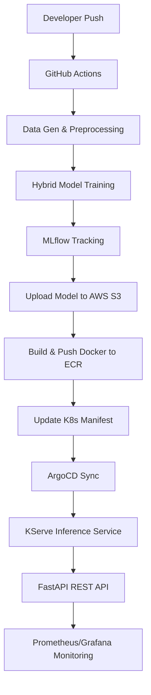

# 🛒 E-Commerce Recommendation Engine (MLOps Edition)

<p align="center">
  
  
  
  
</p>

## 🎯 Project Overview
This is a comprehensive, production-grade **MLOps platform** for an E-Commerce Recommendation Engine. It automates the entire lifecycle of a machine learning model, from synthetic data generation and hybrid model training to automated deployment on Kubernetes using KServe and ArgoCD.

---

## 🏗️ Architecture & Pipeline



### 🛠️ Key MLOps Components:
- **CI/CD/CT**: GitHub Actions automates testing and training (Continuous Training).
- **Model Registry**: AWS S3 stores versioned model artifacts (`.pkl`).
- **Container Registry**: AWS ECR hosts production-ready Docker images.
- **Inference**: **KServe** provides scalable, serverless-style model serving.
- **GitOps**: **ArgoCD** ensures the Kubernetes cluster matches the Git repository state.
- **Observability**: **Prometheus** scrapes custom metrics (latency, rec count) for **Grafana** visualization.

---

## 🚀 Getting Started

### 1. Local Development
```bash
# Clone the repo
git clone https://github.com/bittush8789/E-Commerce-Recommendation-Engine.git
cd E-Commerce-Recommendation-Engine

# Install dependencies
pip install -r requirements.txt

# Generate 50k+ synthetic rows
python generate_data.py

# Train the hybrid model (SVD + XGBoost)
python train.py

# Start the API
uvicorn app:app --reload
```

### 2. Docker Execution
```bash
docker build -t ecommerce-recommender .
docker run -p 8000:8000 ecommerce-recommender
```

### 3. Kubernetes Deployment
1. Configure AWS credentials as GitHub Secrets.
2. Ensure KServe and ArgoCD are installed on your cluster.
3. Apply the ArgoCD application manifest:
   ```bash
   kubectl apply -f argocd/application.yaml
   ```

---

## 📂 File Structure
```text
E-Commerce-Recommendation-Engine/
│── .github/workflows/    # CI/CD/CT Pipelines
│── app.py                # FastAPI Service & Prometheus Metrics
│── train.py              # Hybrid Recommender Training (MLflow)
│── generate_data.py      # Synthetic Data Engine (50k+ rows)
│── requirements.txt      # Production Stack
│── Dockerfile            # App Containerization
│── k8s/                  # Kubernetes (KServe) Manifests
│── argocd/               # GitOps Configuration
│── monitoring/           # Prometheus/Grafana Configs
│── templates/            # Glassmorphism UI (Frontend)
│── static/               # Assets & Logic
└── models/               # Local model cache
```

---

## 🧠 Model Intelligence
The system uses a **Hybrid Recommender Architecture**:
1. **Collaborative Filtering**: SVD (Matrix Factorization) for deep user preference discovery.
2. **Content-Based**: Category-level similarity for fallback.
3. **Ranking**: **XGBoost Ranker** to fine-tune the final list based on price, rating, and engagement weights.

---

## 💼 Resume Value
This project demonstrates expertise in:
- **MLOps Engineering**: End-to-end automation of ML lifecycles.
- **Infrastructure as Code**: Managing K8s/ArgoCD manifests.
- **Full-Stack ML**: Building both the brain (ML models) and the body (FastAPI/Frontend).
- **Cloud Native**: Leveraging AWS (S3, ECR) for scalable AI.

---

## 👨‍💻 Author
**Bittu Sharma**
[GitHub](https://github.com/bittush8789)

---
<p align="center">Empowering E-Commerce with Intelligence</p>