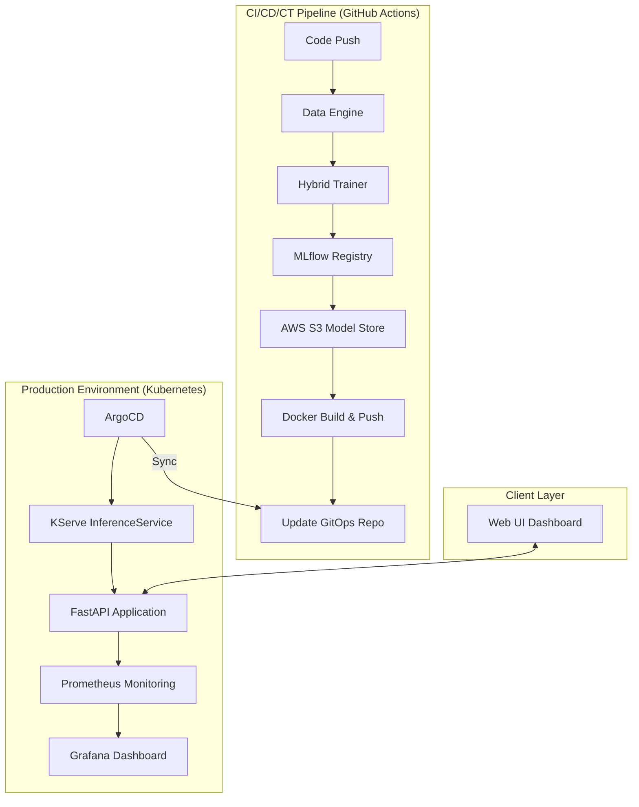

# 🛒 E-Commerce Recommendation Engine: Production-Grade MLOps Platform

[](https://www.python.org/downloads/)
[](https://fastapi.tiangolo.com/)
[](https://kubernetes.io/)
[](https://argoproj.github.io/cd/)
[](https://kserve.github.io/website/)
[](https://aws.amazon.com/)

An end-to-end, enterprise-level MLOps platform designed to provide real-time, highly personalized product recommendations. This system automates the entire ML lifecycle—from high-fidelity synthetic data generation and hybrid model training to automated deployment on Kubernetes via GitOps patterns.

---

## 🏗️ System Architecture

The platform follows a modern **Cloud-Native AI** architecture, ensuring scalability, reproducibility, and high availability.



---

## ⚙️ Step-by-Step MLOps Execution

This project implements a fully automated "Zero-Touch" MLOps workflow. Follow these steps to understand the execution flow:

### **Step 1: Developer Interaction**
The developer modifies the model code in `train.py` or pushes new features.
```bash
git add .
git commit -m "feat: improve recommendation ranking with XGBoost"
git push origin cicd
```

### **Step 2: Automated CI/CT Pipeline (GitHub Actions)**
The push triggers the `.github/workflows/mlops-pipeline.yml` which performs:
1.  **Environment Setup**: Installs dependencies from `requirements.txt`.
2.  **Continuous Training (CT)**:
    -   Runs `generate_data.py` to create a fresh 50k+ row dataset.
    -   Runs `train.py` to retrain the Hybrid Recommender.
3.  **Experiment Tracking**: Metrics (RMSE, Precision) are logged to **MLflow**.

### **Step 3: Artifact & Image Management**
1.  **Model Versioning**: The trained `model.pkl` is pushed to **AWS S3** with a path like `s3://bucket/models/model-<commit-sha>.pkl`.
2.  **Containerization**: A new Docker image is built and pushed to **AWS ECR** tagged with the same `<commit-sha>`.

### **Step 4: GitOps Manifest Update**
The GitHub Action automatically updates the Kubernetes manifest:
-   It uses `sed` to replace the `storageUri` in `k8s/inference.yaml` with the new S3 model path.
-   It commits the updated manifest back to the repository.

### **Step 5: Deployment & Serving (KServe + ArgoCD)**
1.  **ArgoCD Sync**: ArgoCD detects the change in `k8s/inference.yaml` and synchronizes the state.
2.  **KServe Inference**: KServe spins up a new **InferenceService** pod, pulling the model from S3 and the app from ECR.
3.  **Real-time Serving**: The FastAPI application becomes live, serving recommendations via REST endpoints.

### **Step 6: Monitoring (Prometheus & Grafana)**
1.  **Scraping**: Prometheus scrapes the `/metrics` endpoint of the live service.
2.  **Alerting & Visualization**: Grafana displays real-time dashboards for latency, recommendation counts, and model health.

---

## ✨ Key Features

- **🎯 Personalized Intelligence**: Hybrid recommender system using Matrix Factorization (SVD) and XGBoost Ranking.
- **🔄 Automated Lifecycle**: Continuous Training (CT) and Continuous Deployment (CD) via GitHub Actions.
- **⚓ GitOps Deployment**: Automated infrastructure syncing using ArgoCD and Kubernetes manifests.
- **🚀 Serverless Inference**: Scalable model serving powered by KServe (formerly Kubeflow Serving).
- **📊 Real-time Observability**: Prometheus metrics integration for monitoring latency, throughput, and model health.
- **💎 Premium Dashboard**: Modern Dark Glassmorphism UI with responsive design for real-time interaction.
- **🛠️ Cold Start Resilience**: Intelligent fallback to popularity-based models for new users.

---

## 🧰 Technology Stack

| Category | Tools |
| :--- | :--- |
| **Backend** | Python 3.11, FastAPI, Uvicorn |
| **Machine Learning** | Scikit-learn, Surprise, XGBoost, LightFM, Pandas, NumPy |
| **MLOps & DevOps** | GitHub Actions, Docker, **DVC**, **Kind (Kubernetes in Docker)**, KServe, ArgoCD |
| **Data & Tracking** | AWS S3, AWS ECR, MLflow |
| **Monitoring** | Prometheus, Grafana |
| **Frontend** | HTML5, CSS3 (Glassmorphism), Vanilla JavaScript |

---

## 🏗️ Local MLOps Infrastructure (Kind + Docker)

To mirror the production environment locally, we use **Kind (Kubernetes in Docker)**. This allows for testing KServe and ArgoCD manifests without a cloud provider.

### **1. Setup Kind Cluster**
```bash
# Create a cluster with a custom config (if needed for ingress)
kind create cluster --name mlops-cluster

# Verify cluster is running
kubectl cluster-info --context kind-mlops-cluster
```

### **2. Docker Integration**
The application is fully containerized. To load your local image into Kind:
```bash
docker build -t ecommerce-recommender:latest .
kind load docker-image ecommerce-recommender:latest --name mlops-cluster
```

---

## 📦 Data Version Control (DVC)

We use **DVC** to manage large datasets and model artifacts that shouldn't be stored directly in Git. This ensures that every version of our 50k+ row dataset is tracked and reproducible.

### **Track Data Changes**
```bash
# Initialize DVC
dvc init

# Track the generated dataset
dvc add data/interactions.csv

# Push data to remote storage (S3/Local)
dvc push
```

---

## 🛠️ Installation & Setup

### 1. Prerequisites
- Python 3.11+
- Docker (for containerization)
- AWS CLI configured with S3 and ECR access
- A Kubernetes cluster (EKS/Kind/Minikube) with KServe installed

### 2. Local Development
```bash
# Clone the repository
git clone https://github.com/bittush8789/E-Commerce-Recommendation-Engine.git
cd E-Commerce-Recommendation-Engine

# Setup Virtual Environment
python -m venv venv
source venv/bin/activate  # Windows: venv\Scripts\activate

# Install Dependencies
pip install -r requirements.txt

# Generate Synthetic Data (50k+ Rows)
python generate_data.py

# Train Hybrid Model & Log to MLflow
python train.py

# Launch FastAPI Application
uvicorn app:app --reload
```

---

## 🚀 MLOps Pipeline Details

### **Continuous Training (CT)**
Every push to the `main` or `cicd` branch triggers the pipeline:
1. **Data Ingestion**: `generate_data.py` simulates real-world interaction logs.
2. **Training**: `train.py` executes feature engineering and model training.
3. **Artifact Management**: The trained `.pkl` model is uploaded to **AWS S3** with a unique commit SHA.
4. **Image Versioning**: A new Docker image is built and pushed to **AWS ECR**.

### **GitOps Deployment**
1. The pipeline automatically updates the `k8s/inference.yaml` manifest with the new `storageUri`.
2. **ArgoCD** detects the change in the Git repository.
3. The cluster state is automatically reconciled to deploy the latest model version.

---

## 📡 API Documentation

### **Get Recommendations**
`GET /api/recommend/{user_id}?n=10`
- **Response**: List of personalized products for the given user.

### **Similar Products**
`GET /api/similar/{product_id}`
- **Response**: List of items frequently bought with or similar to the target product.

### **Health Check**
`GET /health`
- **Response**: `{"status": "healthy", "model_loaded": true}`

### **Metrics**
`GET /metrics`
- **Response**: Prometheus formatted system metrics.

---

## 📉 Monitoring & Metrics

The system exposes custom Prometheus metrics to track model performance in real-time:
- `request_count`: Total requests processed per endpoint.
- `request_latency_seconds`: Histogram of API response times.
- `recommendation_count`: Total products suggested by the engine.

View the configuration in [monitoring/prometheus.yml](monitoring/prometheus.yml).

---

## 📂 Project Structure

```text
.
├── .github/workflows/    # CI/CD/CT Pipeline Definitions
├── argocd/               # ArgoCD Application Manifests
├── k8s/                  # Kubernetes & KServe Manifests
├── monitoring/           # Prometheus & Grafana Configuration
├── data/                 # Dataset Directory (CSV)
├── models/               # Model Artifacts (.pkl)
├── templates/            # Frontend HTML Pages
├── static/               # Frontend Assets (CSS/JS)
├── app.py                # FastAPI Main Application
├── train.py              # Hybrid Recommender Training Script
├── generate_data.py      # Synthetic Data Generation Engine
├── Dockerfile            # Application Containerization
└── requirements.txt      # Dependency Management
```

---

## 💼 Industry Impact

This project showcases a professional mastery of the **Modern Data Stack** and **MLOps Principles**:
- **Reliability**: Automated deployments ensure zero downtime.
- **Scalability**: KServe enables the model to scale based on traffic.
- **Reproducibility**: DVC-ready patterns and MLflow logging ensure every experiment is tracked.
- **UX-First**: A premium dashboard that turns complex AI output into actionable user value.

---

## 🤝 Contributing

Contributions are welcome! Please follow the standard Git Flow:
1. Fork the Project
2. Create your Feature Branch (`git checkout -b feature/AmazingFeature`)
3. Commit your Changes (`git commit -m 'Add some AmazingFeature'`)
4. Push to the Branch (`git push origin feature/AmazingFeature`)
5. Open a Pull Request

---

## 👨‍💻 Author

**Bittu Sharma**  
[GitHub Profile](https://github.com/bittush8789)  
[LinkedIn Profile](https://linkedin.com/in/your-profile)

---

## 📜 License

Distributed under the **MIT License**. See `LICENSE` for more information.

<p align="center">
  Built with ❤️ for the MLOps Community
</p>